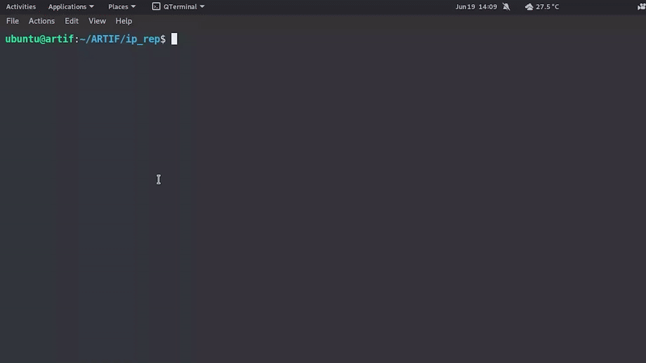
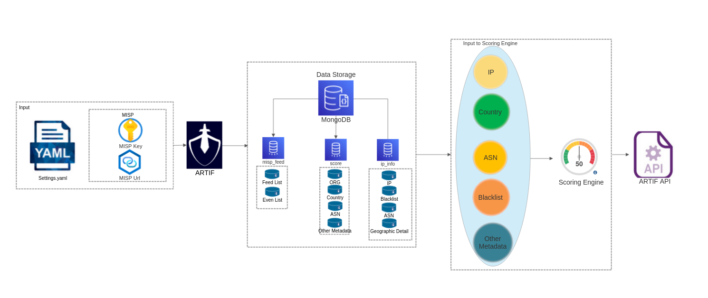

# ARTIF


ARTIF is a new advanced threat intelligence framework built that adds another abstraction layer on the top of MISP to identify threats and malicious web traffic on the basis of IP reputation and historical data. It also performs automatic enrichment and threat scoring by collecting, processing and correlating observables based on different factors. 

Key features of ARTIF includes:- 
- Scoring System: Enriches IP addresses with threat metadata including a threat score which can act as a threshold value for security teams to take action on.
- Containerized: ARTIF is deployed using containers and hence provides ease for deployment.
- Modular Architecture: The project is plugin-based and can be extended easily by just modifyng threat feeds in MISP. There would be no downtime to the actual service as these would be in-line update.
- Alerting: Extended feature providng seamless integration with slack for active alerting. It also provides better attack profiling and visualization.

Some use Cases:-
- Threat Detection
- Logging and Monitoring
- User profiling
- Alerting automation

Why use ARTIF?
It is real time Threat Intel Framework that can help identify malicious IPs even though they are not present in the MISP. This helps organizations to set up first layer of defense by providing transparency over malicious web traffic reaching their servers.

- By default 52 configured open source threat feeds with a database of 0.7M IP addresses.
- Has latency of ~ 180 ms > 10x faster than commercial products.
- Historical IPs are stored for analysis and used in scoring on the basis of past records and patterns.
- Adds score to each IP in addition to other metadata. 

---

## Pre-Requisites

- What is MISP and how to install?

Taken from MISP : *MISP is an open source software solution for collecting, storing, distributing and sharing cyber security indicators and threats about cyber security incidents analysis and malware analysis. MISP is designed by and for incident analysts, security and ICT professionals or malware reversers to support their day-to-day operations to share structured information efficiently.*

MISP can be installed using source code or their pre-built AWS images. More information about MISP installation can be found at their website.

- We need to have subscription to maxmind in order to populate meta-data for the IP.
To add your sub key edit docker-compose.yaml
```
  maxmind:
    image: maxmindinc/geoipupdate
    environment: 
      GEOIPUPDATE_ACCOUNT_ID: xxxxx
      GEOIPUPDATE_LICENSE_KEY: xxxxxxxxxxxxxx
```

---

## Installation 

1. Clone the repository using git or download the zip file.
```
git clone https://github.com/CRED-Dev/ARTIF/
````
2. Build the docker by changing the working directory to the ARTIF folder and start the docker containers for it.
```
sudo docker-compose build
sudo docker-compose up
```
3. Setup MISP and visit the MISP dashboard and get the MISP key. Now edit the config.yaml and add the  MISP_KEY and the MISP_URL values. Here MISP_KEY will be your API key for MISP and MISP_URL will be the URL where MISP is hosted.

Below is a config example.yaml for your reference. Simply replace the corresponding values with your values.
```
credentials:
        MISP_URL: "https://127.0.0.1"
        MISP_KEY: "qwertyuiopasdfghjk"
```
4. Now run the below command with the full absolute path to update_check.py file with -s argument
```
python3 /home/user/ARTIF/ip_rep/feed_ingestor/update_check.py -s
```
5. Now run the same command without -s argument.
```
python3 /home/user/ARTIF/ip_rep/feed_ingestor/update_check.py
```
6. Add the crontab using Django's inbuilt support by running the below command
```
python3 manage.py crontab add
```
7. Start the Django server from the ip_rep directory. 
```
python3 manage.py runserver
```
This will open the port 8000 which can be used to get the metadata for the IP addresses. You can now try getting the threat score for any particular IP.
```
curl 127.0.0.1:8000/ip/?ip=x.x.x.x
```
The output being
```
{"is_IoC": false, "is_Active": false, "metadata": {"asn": "AS165**", "country": "XXX", "org": "XXX"}, "score": 80.14671726301682, "description": "XXX", "blacklists": "", "type": "", "historical":false, verdict": "No action needed"}
```
The score represents a lower risk for the IP as the threat score is high. The higher the score the lesser the non-malicious IP it is. 

**Note:** Instance with 8GB RAM are recommended for ARTIF  installation.

Setting up docker containers


Starting ARTIF 



---

## Adding Custom feeds

ARTIF supports synchronization with MISP. It syncs MISP feeds, picking the most recent config from settings.yaml and all the new events modified from MISP are reflected in settings.yaml. To add new IP, just login to MISP and click on add feed page. Once the IP is added, the cronjob will pick it up according to its schedule and will be processed automatically.

## Documentation

ARTIF being a threat framework, is highly useful for visibility inside organization traffic. It is completely written in python and collects intelligence on an IP from various feeds. It then sends this data to a correlation engine which generates a threat score where historical data is also one of the factors taken into account for threat score calculation.

Every time a new IP hits the service a celery worker is assigned the task to update its score in the database by coordinating with the correlation engine, which in turn gathers data from multiple sources. To ensure that the data isn’t stale (default ‘stale time’ value is 24hrs), we run a worker for each IP in the database which hasn’t been updated for the past ‘stale time’. As with all the other parameters this value is configurable too. Since the threat score calculation is the key to all of this, we’ve laid a lot of emphasis on it. Apart from the well-known threat feeds such as MISP, Cortex, Alien Vault, VirusTotal, and popular blacklist of IPs, we can also add custom feeds according to business and security use case, where customer loyalty can also be used as a parameter for threat score calculation.

For ease of configuration, ARTIF needs the following input to run itself: 

- Feeds in MISP instance.
- A MISP key for communicating with the MISP instance
- A MISP URL to connect to MISP instance using the MISP key.

Upon running, the data is processed and stored on a MongoDB container. MongoDB container contains 3 important databases which stores information about the IP in the feed as well as its metadata for eg.  country/ASN, Org, etc. If the IP is not found in the database that means it’s a new IP reaching the server and whose information is not present in MISP. We then calculate a risk score for the particular IP using an algorithm and various other parameters like geolocation, ASN and Org. More information about the scoring engine can be found here

ARTIF has additional functionality to keep track of old feeds. The default configuration replenishes the latest feeds every 24 hrs. After 24 hrs the old feed is moved to another collection and the latest ones are added. For ease of operation, we have added a field called “historical” in the output which tells if the IP was historically bad. A false value indicates that IP has been recently added to the feeds while a True value suggests that IP was already present in older feeds and hence its a historically malicious IP.

All the historical IP will be removed from database after 7 days by default.


  
## Usage/Examples

You need to invoke ARTIF using update_check.py which is the backbone for ARTIF.
```
ubuntu@localhost:~/ARTIF/ip_rep/feed_ingestor$ python3 /home/user/ARTIF/ip_rep/feed_ingestor/update_check.py -h
usage: update_check.py [-h] [-s [S]] -k [KEY] -m MISP

IP reputation program

optional arguments:
  -h, --help            show this help message and exit
  -s [S]                Required only for the first run
```
You can also look at the cron job by running the below command
```
python3 manage.py crontab show
```
This will auto-update the feed. By default every 24 hrs it will check the MISP for the latest feed and replenish the DB with new IP from feeds. IPs older than 7 
days are also removed by the scheduler.

---
  
## FAQ

#### I am trying to run update_check.py and I am getting a Tag-based error saying tags are already present/removed. How to resolve it? 

You can safely ignore it since this happens when the Tag is already there and we are trying to add it. In that case, it will give an error saying above, and hence the tag removal can’t be done. MISP doesn't have a way to catch those exceptions and hence we have to rely on this way.

#### This is taking too much time. By when will it finish?

This indeed takes time sometimes from 30 mins to 90 mins depending upon your internet speed and RAM. This is basically downloading all the feeds into MongoDB and processing those and hence it will take time and also it is a one-time effort. 

#### I followed the steps mentioned but the MongoDB is still not populated.

Solution: In such cases, run the update_check.py file without -s argument. This would download all the IPs from the feed. This error generally happens when you abruptly interrupt the execution of update_check.py during its initial phase.

## Roadmap

- Application Firewall integration support with ARTIF for automatic blocking malicious IPs based on their threat score.
- Metric visibility over UI dashboard in form of graphical representation to better visualize the threats.
  

## License

[MIT](https://github.com/CRED-Dev/ARTIF/blob/develop/LICENSE)

## Contributing

Contributions are always welcome! 
See `contributing.md` for ways to get started. Please adhere to this project's `code of conduct`.

## Communicating with Team
The easiest way to communicate with the team is via GitHub Issues.

Please file new issues, feature requests, and suggestions, but search for similar open/closed pre-existing issues before creating a new issue.  

---

  
## Authors

- [@0xDivyanshu](https://www.github.com/0xDivyanshu)
- [@logicbomb-1](https://github.com/logicbomb-1/)
  

## Acknowledgements

 - [MISP](https://github.com/MISP/MISP)
 - [Maxmind](https://www.maxmind.com/en/home)
